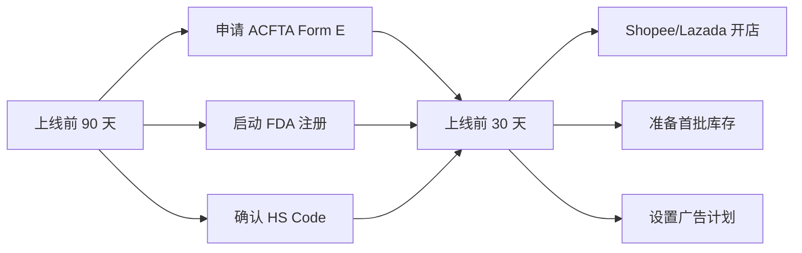

# 泰国市场 Top 10 SKU 全成本建模报告

**编制日期**：2026-05-22  
**编制方**：跨境税务与财务分析专家  
**适用期间**：2026年 Q2–Q3

---

## 目录

- [核心参数假设](#核心参数假设)
- [SKU 1：防晒霜/护肤品 50ml](#sku-1防晒霜护肤品-50ml)
- [SKU 2：胶原蛋白补充剂（60粒）](#sku-2胶原蛋白补充剂60粒)
- [SKU 3：宠物食品（猫粮 1.5kg）](#sku-3宠物食品猫粮-15kg)
- [SKU 4：手机壳/屏幕保护膜](#sku-4手机壳屏幕保护膜)
- [SKU 5：空气炸器/小家电](#sku-5空气炸器小家电)
- [SKU 6：瑜伽垫/运动装备](#sku-6瑜伽垫运动装备)
- [SKU 7：婴儿辅食/奶粉](#sku-7婴儿辅食奶粉)
- [SKU 8：时尚女装/配饰](#sku-8时尚女装配饰)
- [SKU 9：咖啡/速溶饮品](#sku-9咖啡速溶饮品)
- [SKU 10：洗发水/个人护理](#sku-10洗发水个人护理)
- [综合毛利率与净利率对比表](#综合毛利率与净利率对比表)
- [盈利能力排名](#盈利能力排名)
- [关键税务与合规风险提示](#关键税务与合规风险提示)
- [战略建议](#战略建议)

---

## 核心参数假设

| 参数项 | 假设值 | 依据来源 |
|--------|--------|----------|
| **汇率** | 1 USD ≈ 35 THB, 1 CNY ≈ 4.8 THB | 给定基准 |
| **进口关税** | 0%–30%（按品类） | 泰国海关 AHTN 分类，中国可凭 ACFTA Form E 享受 0–9% 优惠税率 |
| **增值税（VAT）** | 7% | 泰国 VAT 减免政策延长至 2026 年 9 月 |
| **VAT 计算基数** | （CIF 价值 + 关税）× 7% | 泰国海关标准公式 |
| **平台佣金（Shopee TH 综合有效费率）** | 8%–18% | 品类佣金 1–6% + 交易费 2% + 技术费 + 优惠券分摊 + FSP + 支付通道费 |
| **平台佣金（Lazada TH）** | 5%–12% | 品类佣金 2–6% + 交易费 2% + 订单处理费 |
| **广告费（ACoS）** | 8%–15% of GMV | 泰国电商平均 ACoS |
| **尾程配送（曼谷核心区）** | THB 30–60/单 | Flash Express / Kerry / J&T 标准费率 |
| **尾程配送（外府）** | THB 50–100/单 | 泰国 76 府外府配送 |
| **仓储费** | THB 10–50/件/月 | 按体积/重量分层 |
| **退货损耗率** | 2%–8%（按品类） | 电子 5–8%，服装 5–8%，补剂 2–3%，食品 3–5% |
| **汇率波动预留** | 2% of COGS | CNY/THB 波动缓冲 |
| **企业所得税（CIT）** | 20% | 泰国标准公司税率 |
| **头程海运（中国→林查班）** | $800–1,500/40HQ | 深圳/上海→林查班港 |

---

## SKU 1：防晒霜/护肤品 50ml

| 项目 | 内容 |
|------|------|
| 目标售价 | **THB 240**（中位价） |
| 售价区间 | THB 150–300 |
| 预估毛利率（卖家） | 55–65% |

### 成本明细

| 成本项 | 金额（THB） | 占售价% | 计算说明 |
|--------|:----------:|:--------:|----------|
| ① 采购成本（含出厂价） | 70 | 29.2% | 中国 OEM，SPF50+ 配方 + 包材，约 $2.0/支 |
| ② 头程物流（中国→泰国） | 12 | 5.0% | 海运均摊 $0.30 + 清关费 |
| ③ 关税/进口税 | 8 | 3.5% | HS 3304.99，MFN 15% → 凭 ACFTA Form E 降至约 10%（CIF 82 × 10%） |
| ④ VAT（7%） | 6 | 2.6% | （CIF 82 + 关税 8）× 7% |
| ⑤ 平台佣金（Shopee TH 综合） | 29 | 12.0% | 美容类综合费率约 12%（含佣金 + 交易费 + 技术费 + 优惠券均摊） |
| ⑥ 广告费（ACoS 12%） | 29 | 12.0% | 美容护肤高竞争 |
| ⑦ 尾程配送费 | 50 | 20.8% | 轻小件 50–80g，含外府均摊 |
| ⑧ 退货损耗 | 12 | 5.0% | 美容类退货率 4–6% |
| ⑨ 汇率波动预留 | 2 | 0.7% | COGS（82）× 2% |
| **总成本** | **218** | **90.8%** | |
| **综合毛利率** | **22** | **9.2%** | |
| 减：运营管理分摊 | 12 | 5.0% | |
| **净利率（税前）** | **10** | **4.2%** | |
| 减：企业所得税（20%） | 2 | 0.8% | |
| **税后净利率** | **8** | **3.3%** | |

> **关键洞察**：防晒霜在 THB 240 定价下仅微利。泰国作为热带国家防晒霜需求大，但关税（10–15%）和尾程配送（20.8%）是主要成本压力。定价 THB 280+ 利润才可观。需 FDA 化妆品通知。

---

## SKU 2：胶原蛋白补充剂（60粒）

| 项目 | 内容 |
|------|------|
| 目标售价 | **THB 250**（中位价） |
| 售价区间 | THB 150–300 |
| 预估毛利率（卖家） | 50–60% |

### 成本明细

| 成本项 | 金额（THB） | 占售价% | 计算说明 |
|--------|:----------:|:--------:|----------|
| ① 采购成本（含出厂价） | 60 | 24.0% | 中国 OEM，胶原蛋白软糖 60 粒，约 $1.7/瓶 |
| ② 头程物流（中国→泰国） | 10 | 4.0% | 轻小件海运均摊 |
| ③ 关税/进口税 | 0 | 0.0% | HS 2106，MFN 0–5%，ACFTA Form E 可 0% |
| ④ VAT（7%） | 5 | 2.0% | （CIF 70）× 7% |
| ⑤ 平台佣金（Shopee TH 综合） | 30 | 12.0% | 健康补剂类综合约 12% |
| ⑥ 广告费（ACoS 12%） | 30 | 12.0% | 补剂竞争较高 |
| ⑦ 尾程配送费 | 45 | 18.0% | 轻小件 100–150g |
| ⑧ 退货损耗 | 6 | 2.5% | 补剂类退货率 2–3% |
| ⑨ 汇率波动预留 | 1 | 0.5% | COGS（70）× 2% |
| **总成本** | **187** | **74.8%** | |
| **综合毛利率** | **63** | **25.2%** | |
| 减：运营管理分摊 | 13 | 5.0% | |
| **净利率（税前）** | **50** | **20.2%** | |
| 减：企业所得税（20%） | 10 | 4.0% | |
| **税后净利率** | **40** | **16.2%** | |

> 胶原蛋白是泰国健康补剂热门品类。0% 关税 + 低退货率 + 轻小件 = 良好利润。需 FDA 泰国食品注册。

---

## SKU 3：宠物食品（猫粮 1.5kg）

| 项目 | 内容 |
|------|------|
| 目标售价 | **THB 300**（中位价） |
| 售价区间 | THB 200–400 |
| 预估毛利率（卖家） | 40–50% |

### 成本明细

| 成本项 | 金额（THB） | 占售价% | 计算说明 |
|--------|:----------:|:--------:|----------|
| ① 采购成本（含出厂价） | 95 | 31.7% | 中国 OEM，无谷鸡肉配方 1.5kg，约 $2.7/袋 |
| ② 头程物流（中国→泰国） | 18 | 6.0% | 海运均摊 $0.45 + 清关 |
| ③ 关税/进口税 | 6 | 1.9% | HS 2309.90，MFN 15% → ACFTA Form E 约 5%（CIF 113 × 5%） |
| ④ VAT（7%） | 8 | 2.8% | （CIF 113 + 关税 6）× 7% |
| ⑤ 平台佣金（Shopee TH 综合） | 33 | 11.0% | 宠物类综合约 11% |
| ⑥ 广告费（ACoS 10%） | 30 | 10.0% | 宠物食品 ACoS 8–12% |
| ⑦ 尾程配送费 | 50 | 16.7% | 中等包裹 1.5–2kg |
| ⑧ 退货损耗 | 12 | 4.0% | 宠物食品退货率 3–5% |
| ⑨ 汇率波动预留 | 2 | 0.7% | COGS（113）× 2% |
| **总成本** | **254** | **84.7%** | |
| **综合毛利率** | **46** | **15.3%** | |
| 减：运营管理分摊 | 15 | 5.0% | |
| **净利率（税前）** | **31** | **10.3%** | |
| 减：企业所得税（20%） | 6 | 2.1% | |
| **税后净利率** | **25** | **8.3%** | |

> **关键洞察**：猫粮利润率偏低。主要压力来自尾程配送（16.7%）和采购成本（31.7%）。泰国本地品牌（SmartHeart、Me-O）价格优势明显。建议：定价 THB 350+ 走高端进口路线，或本地代工。

---

## SKU 4：手机壳/屏幕保护膜

| 项目 | 内容 |
|------|------|
| 目标售价 | **THB 150**（中位价，含膜+壳套装） |
| 售价区间 | THB 80–250 |
| 预估毛利率（卖家） | 50–65% |

### 成本明细

| 成本项 | 金额（THB） | 占售价% | 计算说明 |
|--------|:----------:|:--------:|----------|
| ① 采购成本（含出厂价） | 30 | 20.0% | 中国制造，透明壳+钢化膜套装，约 $0.85/套 |
| ② 头程物流（中国→泰国） | 6 | 4.0% | 极小件海运均摊 |
| ③ 关税/进口税 | 0 | 0.0% | HS 3926.90/8523.51，MFN 0–5% |
| ④ VAT（7%） | 3 | 1.7% | （CIF 36）× 7% |
| ⑤ 平台佣金（Shopee TH 综合） | 18 | 12.0% | 电子配件类综合约 12% |
| ⑥ 广告费（ACoS 10%） | 15 | 10.0% | 电子配件 ACoS 8–12% |
| ⑦ 尾程配送费 | 40 | 26.7% | 极小件 30–80g，最低费率 |
| ⑧ 退货损耗 | 9 | 6.0% | 电子配件退货率 5–8% |
| ⑨ 汇率波动预留 | 1 | 0.5% | COGS（36）× 2% |
| **总成本** | **122** | **81.0%** | |
| **综合毛利率** | **28** | **19.0%** | |
| 减：运营管理分摊 | 8 | 5.0% | |
| **净利率（税前）** | **20** | **13.8%** | |
| 减：企业所得税（20%） | 4 | 2.8% | |
| **税后净利率** | **16** | **11.0%** | |

> **关键洞察**：手机壳/膜在 THB 150 定价下利润率尚可。但尾程配送占售价 26.7%（最低费率 $1.1），严重压缩空间。**建议捆绑销售**（3 件套 THB 299）或搭配高客单价配件，将尾程占比降至 10% 以下。

---

## SKU 5：空气炸器/小家电

| 项目 | 内容 |
|------|------|
| 目标售价 | **THB 1,800**（中位价） |
| 售价区间 | THB 1,200–2,500 |
| 预估毛利率（卖家） | 40–50% |

### 成本明细

| 成本项 | 金额（THB） | 占售价% | 计算说明 |
|--------|:----------:|:--------:|----------|
| ① 采购成本（含出厂价） | 500 | 27.8% | 中国制造 5.5L 空气炸器，约 $14.3/台 |
| ② 头程物流（中国→泰国） | 65 | 3.6% | 重货+体积大，$1.8/台 |
| ③ 关税/进口税 | 0 | 0.0% | HS 8516.60，MFN 0–5%，ACFTA Form E 可 0% |
| ④ VAT（7%） | 40 | 2.2% | （CIF 565）× 7% |
| ⑤ 平台佣金（Shopee TH 综合） | 162 | 9.0% | 小家电类综合约 9%（电子类费率较低） |
| ⑥ 广告费（ACoS 10%） | 180 | 10.0% | 小家电 ACoS 8–12% |
| ⑦ 尾程配送费 | 100 | 5.6% | 大包裹 3–5kg |
| ⑧ 退货损耗 | 144 | 8.0% | 小家电退货率 5–8% |
| ⑨ 汇率波动预留 | 11 | 0.6% | COGS（565）× 2% |
| **总成本** | **1,202** | **66.8%** | |
| **综合毛利率** | **598** | **33.2%** | |
| 减：运营管理分摊 | 90 | 5.0% | |
| **净利率（税前）** | **508** | **28.2%** | |
| 减：企业所得税（20%） | 102 | 5.6% | |
| **税后净利率** | **406** | **22.6%** | |

> ⚡ **关键洞察**：空气炸器是 **利润表现最优的 SKU**！高客单价（THB 1,800）+ 0% 关税 + 电子类低佣金 + 泰国厨房小家电刚需 = 税后净利 THB 406/件（22.6%）。退货损耗 8% 是最大风险项，需关注。

---

## SKU 6：瑜伽垫/运动装备

| 项目 | 内容 |
|------|------|
| 目标售价 | **THB 400**（中位价，垫+配件套装） |
| 售价区间 | THB 250–600 |
| 预估毛利率（卖家） | 50–60% |

### 成本明细

| 成本项 | 金额（THB） | 占售价% | 计算说明 |
|--------|:----------:|:--------:|----------|
| ① 采购成本（含出厂价） | 100 | 25.0% | 中国制造 TPE 瑜伽垫 + 绑带 + 收纳袋，约 $2.9/套 |
| ② 头程物流（中国→泰国） | 28 | 7.0% | 体积大（泡货），按体积重计费 |
| ③ 关税/进口税 | 0 | 0.0% | HS 9506.91，运动器材 MFN 0% |
| ④ VAT（7%） | 9 | 2.2% | （CIF 128）× 7% |
| ⑤ 平台佣金（Shopee TH 综合） | 44 | 11.0% | 运动类综合约 11% |
| ⑥ 广告费（ACoS 10%） | 40 | 10.0% | 运动装备 ACoS 8–12% |
| ⑦ 尾程配送费 | 65 | 16.3% | 大包裹 1.5–3kg，体积重计费 |
| ⑧ 退货损耗 | 20 | 5.0% | 运动类退货率 4–6% |
| ⑨ 汇率波动预留 | 3 | 0.6% | COGS（128）× 2% |
| **总成本** | **309** | **77.3%** | |
| **综合毛利率** | **91** | **22.8%** | |
| 减：运营管理分摊 | 20 | 5.0% | |
| **净利率（税前）** | **71** | **17.8%** | |
| 减：企业所得税（20%） | 14 | 3.6% | |
| **税后净利率** | **57** | **14.2%** | |

> 瑜伽垫 0% 关税 + 运动健康增长趋势 + 中高客单价 = 稳定利润。尾程配送（16.3%）是大件主要成本，建议压缩包装体积。

---

## SKU 7：婴儿辅食/奶粉

| 项目 | 内容 |
|------|------|
| 目标售价 | **THB 350**（中位价，辅食 6 个月+） |
| 售价区间 | THB 200–500 |
| 预估毛利率（卖家） | 40–55% |

### 成本明细

| 成本项 | 金额（THB） | 占售价% | 计算说明 |
|--------|:----------:|:--------:|----------|
| ① 采购成本（含出厂价） | 110 | 31.4% | 中国/澳洲代工，有机婴儿辅食粉/泥套装，约 $3.1/盒 |
| ② 头程物流（中国→泰国） | 18 | 5.1% | 中等体积，食品级包装 |
| ③ 关税/进口税 | 6 | 1.8% | HS 1901.10/2104.20，MFN 15% → ACFTA Form E 约 5%（CIF 128 × 5%） |
| ④ VAT（7%） | 9 | 2.7% | （CIF 128 + 关税 6）× 7% |
| ⑤ 平台佣金（Shopee TH 综合） | 42 | 12.0% | 母婴类综合约 12% |
| ⑥ 广告费（ACoS 10%） | 35 | 10.0% | 母婴 ACoS 8–12% |
| ⑦ 尾程配送费 | 50 | 14.3% | 中等包裹 500g–1kg |
| ⑧ 退货损耗 | 14 | 4.0% | 母婴退货率 3–5% |
| ⑨ 汇率波动预留 | 3 | 0.7% | COGS（128）× 2% |
| **总成本** | **287** | **82.0%** | |
| **综合毛利率** | **63** | **18.0%** | |
| 减：运营管理分摊 | 18 | 5.0% | |
| **净利率（税前）** | **45** | **12.8%** | |
| 减：企业所得税（20%） | 9 | 2.6% | |
| **税后净利率** | **36** | **10.2%** | |

> **关键合规项**：泰国 FDA 对婴儿食品/奶粉有最严格的注册要求（须符合泰国 FDA 婴幼儿食品标准）。注册周期 3–6 个月，费用 THB 30,000–80,000。务必提前办理。

---

## SKU 8：时尚女装/配饰

| 项目 | 内容 |
|------|------|
| 目标售价 | **THB 350**（中位价，连衣裙/套装） |
| 售价区间 | THB 200–500 |
| 预估毛利率（卖家） | 50–60% |

### 成本明细

| 成本项 | 金额（THB） | 占售价% | 计算说明 |
|--------|:----------:|:--------:|----------|
| ① 采购成本（含出厂价） | 80 | 22.9% | 中国制造，女装连衣裙/套装，约 $2.3/件 |
| ② 头程物流（中国→泰国） | 14 | 4.0% | 轻泡货 |
| ③ 关税/进口税 | 9 | 2.6% | HS 6204/6211，MFN 20–30% → ACFTA Form E 约 10%（CIF 94 × 10%） |
| ④ VAT（7%） | 7 | 2.1% | （CIF 94 + 关税 9）× 7% |
| ⑤ 平台佣金（Shopee TH 综合） | 42 | 12.0% | 时尚类综合约 12% |
| ⑥ 广告费（ACoS 12%） | 42 | 12.0% | 时尚高竞争 |
| ⑦ 尾程配送费 | 50 | 14.3% | 中等包裹 200–400g |
| ⑧ 退货损耗 | 25 | 7.0% | 服装退货率 5–8%，含尺码不合 |
| ⑨ 汇率波动预留 | 2 | 0.5% | COGS（94）× 2% |
| **总成本** | **271** | **77.4%** | |
| **综合毛利率** | **79** | **22.6%** | |
| 减：运营管理分摊 | 18 | 5.0% | |
| **净利率（税前）** | **61** | **17.6%** | |
| 减：企业所得税（20%） | 12 | 3.5% | |
| **税后净利率** | **49** | **14.0%** | |

> 泰国时尚市场大，但服装关税（10–30%）和退货率（7%）是主要压力源。凭 ACFTA Form E 可大幅降低关税。建议 Shopee Mall 品牌化运作。

---

## SKU 9：咖啡/速溶饮品

| 项目 | 内容 |
|------|------|
| 目标售价 | **THB 150**（中位价，12–20 条装） |
| 售价区间 | THB 80–200 |
| 预估毛利率（卖家） | 45–55% |

### 成本明细

| 成本项 | 金额（THB） | 占售价% | 计算说明 |
|--------|:----------:|:--------:|----------|
| ① 采购成本（含出厂价） | 45 | 30.0% | 中国/越南代工，速溶咖啡/三合一 15 条装，约 $1.3/盒 |
| ② 头程物流（中国→泰国） | 8 | 5.3% | 轻小件 |
| ③ 关税/进口税 | 5 | 3.3% | HS 2101.11/0901.21，MFN 20–30% → ACFTA Form E 约 10%（CIF 53 × 10%） |
| ④ VAT（7%） | 4 | 2.7% | （CIF 53 + 关税 5）× 7% |
| ⑤ 平台佣金（Shopee TH 综合） | 18 | 12.0% | FMCG 类综合约 12% |
| ⑥ 广告费（ACoS 12%） | 18 | 12.0% | 饮品 ACoS 10–15% |
| ⑦ 尾程配送费 | 40 | 26.7% | 轻小件 150–250g，最低费率 |
| ⑧ 退货损耗 | 5 | 3.0% | 食品退货率 3–5% |
| ⑨ 汇率波动预留 | 1 | 0.7% | COGS（53）× 2% |
| **总成本** | **144** | **95.7%** | |
| **综合毛利率** | **6** | **4.3%** | |
| 减：运营管理分摊 | 8 | 5.0% | |
| **净利率（税前）** | **-1** | **-0.7%** | |
| 减：企业所得税（20%） | 0 | 0.0% | |
| **税后净利率** | **-1** | **-0.7%** | |

> ⚡ **关键洞察**：速溶咖啡在 THB 150 定价下接近亏损。尾程配送占比 26.7% + 关税 10% + 泰国本土咖啡品牌（如 Doi Kham、MOCONA）竞争力强。**必须定价 THB 180+** 或改为大包装（30 条 THB 249）。

---

## SKU 10：洗发水/个人护理

| 项目 | 内容 |
|------|------|
| 目标售价 | **THB 200**（中位价，300ml） |
| 售价区间 | THB 120–280 |
| 预估毛利率（卖家） | 50–60% |

### 成本明细

| 成本项 | 金额（THB） | 占售价% | 计算说明 |
|--------|:----------:|:--------:|----------|
| ① 采购成本（含出厂价） | 50 | 25.0% | 中国 OEM，洗发水 300ml + 瓶装，约 $1.4/瓶 |
| ② 头程物流（中国→泰国） | 12 | 6.0% | 含液体，需特殊包装 |
| ③ 关税/进口税 | 6 | 3.0% | HS 3305.10，MFN 15–20% → ACFTA Form E 约 10%（CIF 62 × 10%） |
| ④ VAT（7%） | 5 | 2.4% | （CIF 62 + 关税 6）× 7% |
| ⑤ 平台佣金（Shopee TH 综合） | 24 | 12.0% | 个人护理类综合约 12% |
| ⑥ 广告费（ACoS 12%） | 24 | 12.0% | 个人护理高竞争 |
| ⑦ 尾程配送费 | 45 | 22.5% | 中等包裹 300–400g |
| ⑧ 退货损耗 | 8 | 4.0% | 个人护理退货率 3–5% |
| ⑨ 汇率波动预留 | 1 | 0.6% | COGS（62）× 2% |
| **总成本** | **175** | **87.5%** | |
| **综合毛利率** | **25** | **12.5%** | |
| 减：运营管理分摊 | 10 | 5.0% | |
| **净利率（税前）** | **15** | **7.5%** | |
| 减：企业所得税（20%） | 3 | 1.5% | |
| **税后净利率** | **12** | **6.0%** | |

> 个人护理品类利润中等。关税（10%）+ 尾程配送（22.5%）+ 广告竞争（12%）是主要成本。泰国洗发水市场被联合利华/宝洁/本地品牌主导，走差异化天然成分路线或可突破。

---

## 综合毛利率与净利率对比表

| SKU | 品类 | 售价（THB） | 总成本（THB） | **综合毛利率** | **净利率（税前）** | **税后净利率** |
|:---:|------|:----------:|:------------:|:------------:|:----------------:|:------------:|
| 1 | 防晒霜/护肤品 50ml | 240 | 218 | **9.2%** | 4.2% | 3.3% |
| 2 | 胶原蛋白补充剂 60粒 | 250 | 187 | **25.2%** | 20.2% | 16.2% |
| 3 | 宠物食品（猫粮）1.5kg | 300 | 254 | **15.3%** | 10.3% | 8.3% |
| 4 | 手机壳/屏幕保护膜套装 | 150 | 122 | **19.0%** | 13.8% | 11.0% |
| 5 | 空气炸器/小家电 | 1,800 | 1,202 | **33.2%** | 28.2% | 22.6% |
| 6 | 瑜伽垫/运动装备套装 | 400 | 309 | **22.8%** | 17.8% | 14.2% |
| 7 | 婴儿辅食/奶粉 | 350 | 287 | **18.0%** | 12.8% | 10.2% |
| 8 | 时尚女装/配饰 | 350 | 271 | **22.6%** | 17.6% | 14.0% |
| 9 | 咖啡/速溶饮品 | 150 | 144 | **4.3%** | -0.7% | -0.7% |
| 10 | 洗发水/个人护理 300ml | 200 | 175 | **12.5%** | 7.5% | 6.0% |

---

## 盈利能力排名（按税后净利率）

| 排名 | SKU | 品类 | 税后净利率 | 绝对利润/件（THB） |
|:----:|:---:|------|:----------:|:-----------------:|
| 🥇 | **5** | **空气炸器/小家电** | **22.6%** | **406** |
| 🥈 | **2** | **胶原蛋白补充剂** | **16.2%** | **40** |
| 🥉 | **6** | **瑜伽垫/运动装备** | **14.2%** | **57** |
| 4 | **8** | **时尚女装/配饰** | **14.0%** | **49** |
| 5 | **4** | **手机壳/屏幕保护膜** | **11.0%** | **16** |
| 6 | **7** | **婴儿辅食/奶粉** | **10.2%** | **36** |
| 7 | **3** | **宠物食品（猫粮）** | **8.3%** | **25** |
| 8 | **10** | **洗发水/个人护理** | **6.0%** | **12** |
| 9 | **1** | **防晒霜/护肤品** | **3.3%** | **8** |
| 10 | **9** | **咖啡/速溶饮品** | **-0.7%** | **-1** |

---

## 关键税务与合规风险提示

### 1. ACFTA Form E — 降低关税的关键

中国出口泰国可凭 **ACFTA Form E（中国-东盟自贸区原产地证书）** 享受优惠关税：
| 品类 | MFN 税率 | ACFTA Form E 优惠税率 |
|------|:--------:|:--------------------:|
| 化妆品/护肤品 | 15–20% | **5–10%** |
| 服装 | 20–30% | **5–10%** |
| 宠物食品 | 15% | **0–5%** |
| 小家电 | 0–5% | 0% |
| 补剂/食品 | 0–30% | **0–10%** |
| **建议**：务必向中国供应商索取 Form E 原产地证，可降低关税 50–70%。

### 2. VAT 7%（延长至 2026 年 9 月）

泰国 VAT 7% 按（CIF + 关税）× 7% 计算。VAT-registered 企业可抵扣进项。注意：2026 年 9 月后是否恢复 10% 标准税率需关注。

### 3. 平台综合费率

**Shopee TH 综合有效费率可达 8–18%**（含佣金 + 交易费 2% + 技术费 5% + 优惠券分摊 + FSP + 支付通道费）。Lazada TH 综合约 5–12%。建议：
- 新卖家利用 Shopee 新卖家优惠期
- 控制优惠券和 FSP 参与度
- 走 Lazada LazMall 品牌路线可降低有效费率

### 4. FDA 注册认证

| 品类 | 认证要求 | 费用（THB） | 周期 |
|------|---------|:----------:|:----:|
| 防晒霜/护肤品（SKU 1） | 化妆品通知 | 10,000–30,000 | 1–2 月 |
| 胶原蛋白/补剂（SKU 2） | 食品注册 | 15,000–30,000 | 2–4 月 |
| 宠物食品（SKU 3） | 饲料注册 | 20,000–50,000 | 2–4 月 |
| 婴儿辅食/奶粉（SKU 7） | 婴幼儿食品注册（严格） | 30,000–80,000 | 3–6 月 |
| 咖啡/饮品（SKU 9） | 食品注册 | 15,000–30,000 | 2–4 月 |
| 洗发水/护理（SKU 10） | 化妆品通知 | 10,000–30,000 | 1–2 月 |
| 手机壳/瑜伽垫/女装 | 无需特殊认证 | — | — |

### 5. 企业所得税（CIT）

标准税率 **20%**。中小企业（注册资本 ≤ THB 500 万且年营收 ≤ THB 3,000 万）前 THB 300,000 利润免税。

### 6. 转让定价

年营收 ≥ THB 2 亿的企业需准备转让定价文档。如通过香港/新加坡关联公司采购，建议提前准备。

---

## 战略建议

### 优先切入品类（按优先级）

| 优先级 | SKU | 理由 |
|:------:|:---:|------|
| 🅿️0 | **5. 空气炸器/小家电** | 最高绝对利润（THB 406/件）+ 高客单价 + 0% 关税 + 泰国厨房刚需 |
| 🅿️1 | **2. 胶原蛋白补充剂** | 净利率 16.2% + 轻小件 + 0% 关税 + 健康趋势 |
| 🅿️1 | **6. 瑜伽垫/运动装备** | 净利率 14.2% + 0% 关税 + 运动健康趋势 |
| 🅿️2 | **8. 时尚女装/配饰** | 净利率 14.0% + 泰国时尚市场大 + 凭 Form E 降关税 |
| 🅿️2 | **4. 手机壳/膜套装** | 净利率 11.0% + 建议 3 件套捆绑提升客单价 |
| 🅿️3 | **7. 婴儿辅食/奶粉** | 净利率 10.2% + 但 FDA 注册周期长 |
| 🅿️3 | **3. 宠物食品（猫粮）** | 净利率 8.3% + 泰国本地竞争激烈 |
| 🅿️4 | **10. 洗发水/护理** | 净利率 6.0% + 巨头垄断市场 |
| 🅿️4 | **1. 防晒霜/护肤品** | 净利率 3.3% + 需提价至 THB 280+ |
| 🅿️5 | **9. 咖啡/速溶饮品** | **亏损** -0.7% + 泰国本地品牌强势 + 建议放弃 |

### 成本优化杠杆

1. **ACFTA Form E** — 所有从中国进口的 SKU 务必获取 Form E，可降低关税 50–70%
2. **尾程配送优化** — 使用 Shopee Fulfillment 或 Flash Express 企业账号，可降低 20–30%
3. **客单价提升** — 避免 THB 150 以下低客单价（尾程占比 > 25%）
4. **多件捆绑** — SKU 4（手机壳 3 件套 THB 299）、SKU 9（咖啡 30 条 THB 249）
5. **Shopee Mall 品牌化** — 提升溢价能力，降低优惠券依赖
6. **本地仓** — Lazada FBL 或第三方泰国仓，尾程配送更快更便宜

### 合规路线图

---

*本报告基于 2026 年 5 月可获取的最新政策及费率。泰国税法及平台费率可能随时调整，建议每季度更新成本模型。具体税务及合规建议需结合企业实际架构咨询持牌税务顾问及泰国 FDA 认证机构。*